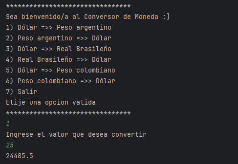

# Conversor de Monedas 🌎💱 

Este es un proyecto simple de conversión de monedas utilizando la API de [ExchangeRate-API](https://www.exchangerate-api.com/). El programa permite convertir valores entre diferentes divisas de manera interactiva a través de un menú en la consola.

## Características

- Conversión de monedas entre:
  - Dólar (USD) y Peso Argentino (ARS)
  - Dólar (USD) y Real Brasileño (BRL)
  - Dólar (USD) y Peso Boliviano (BOB)
- Lectura de los valores actuales de cambio de la API.
- Menú interactivo para seleccionar opciones de conversión.

## Requisitos

- **Java 11+**
- Biblioteca `Gson` para parseo de JSON. (Se puede agregar usando Maven, Gradle o descargando el JAR manualmente).
  
## Instalación

1. Clona el repositorio en tu máquina local:

```bash
git clone https://github.com/V1kt0or/Conversor-de-Moneda.git
```

2. Instala las dependencias necesarias (Gson si no la tienes instalada).

### Con Maven
Si usas Maven, agrega la dependencia de `Gson` en tu archivo `pom.xml`:

```xml
<dependency>
    <groupId>com.google.code.gson</groupId>
    <artifactId>gson</artifactId>
    <version>2.8.8</version>
</dependency>
```

### Con Gradle
Si usas Gradle, añade esta línea en tu `build.gradle`:

```gradle
implementation 'com.google.code.gson:gson:2.8.8'
```

3. Configura tu API Key. Dentro del código fuente (`Main.java`), actualiza la URL de la API con tu clave personal obtenida en [ExchangeRate-API](https://www.exchangerate-api.com/):

```java
String direccion = "https://v6.exchangerate-api.com/v6/<YOUR_API_KEY>/latest/USD";
```

## Uso

1. Ejecuta el programa en tu entorno de desarrollo favorito o desde la terminal.
2. Selecciona la opción de conversión que desees del menú interactivo.
3. Ingresa el valor a convertir.
4. El programa obtendrá las tasas de cambio actualizadas desde la API y te mostrará el resultado.

### Ejemplo de ejecución

```bash
********************************
Sea bienvenido/a al Conversor de Moneda :]
1) Dólar =>> Peso argentino
2) Peso argentino =>> Dólar
3) Dólar =>> Real Brasileño
4) Real Brasileño =>> Dólar
5) Dólar =>> Peso Boliviano
6) Peso Boliviano =>> Dólar
7) Salir
Elije una opción valida
********************************
```

## Estructura del proyecto

- **`Main.java`**: Contiene la lógica principal de la aplicación, incluyendo el menú interactivo y las llamadas a la API.
- **`MonedaDto.java`**: Clase que representa la estructura del JSON devuelto por la API.
- **`Moneda.java`**: Clase que realiza las conversiones entre las diferentes monedas.
  
## Contribuciones

¡Las contribuciones son bienvenidas! Si tienes mejoras o deseas corregir errores, simplemente abre un `pull request` o crea una `issue` para discutir los cambios.

## Licencia

Este proyecto está bajo la licencia MIT. Puedes ver más detalles en el archivo [LICENSE](LICENSE).
